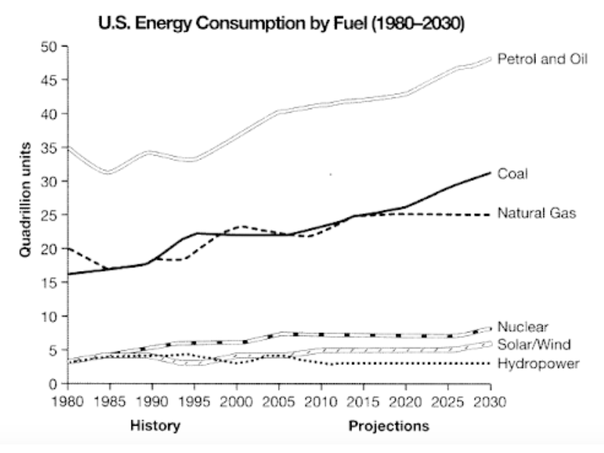

# U.S. Energy Consumption by Fuel (1980-2030)
The graph below gives information from a 2008 report about consumption of energy in the USA since 1980 with projections until 2030. Summarise the information by selecting and reporting the main features and make comparisons where relevant. Write at least 150 words.

---

The line graph above shows the rate of energy consumption in the US since 1980 with predictions until 2030. 

In a nutshell, petrol and oil were the main source of energy in the US with coal followed by coal and natural gas while renewable energy has the least consumption.

Despite the flunctuations between 1980 and 1995, consumption of petrol and oil had been increasing steadily and was predicted to capture half of the market at 2030. Moreover, both coal and natural gas consumption showed similar historical data before 2015 but coal consumption was projected to increase continually wheras natural gas consumption stays stagnant until 2030.

On the lower end of the comparison, nuclear consumption was the highest and despite its steady rate between 2005 and 2025, it was projected to grow after 2025. Meanwhile, hydropower and solar/wind consumption shares similar trajectory before 2005. However, hyrodpower consumption decreased since then and kept steady throughout 2010 and 2030 while solar/wind consumption increased to 5 quadrillion units and was expected to start growing again in 2025.

(175 words)